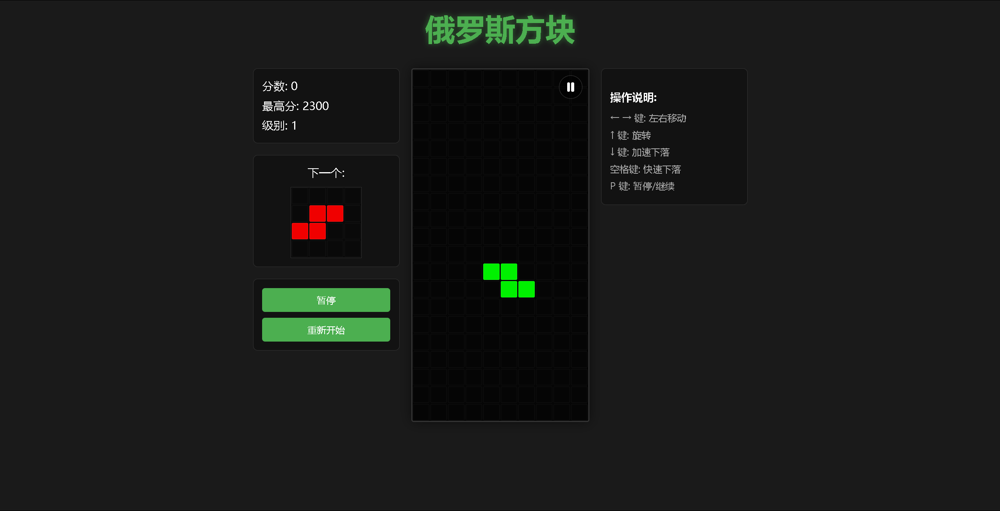

# Vue3 Tetris Game

A modern Tetris game developed with Vue3 and TypeScript. The game maintains the core gameplay of classic Tetris while adopting a modern technology stack and elegant interface design. It supports both PC and mobile devices, providing a great cross-device experience.



## Version

Current Version: v1.0.2

### Changelog

View the complete [Changelog](./CHANGELOG.md)

## Features

- Classic Tetris gameplay
- Support for piece rotation and movement
- Real-time score tracking and high score recording
- Next piece preview
- Level system that automatically increases speed with score
- Game pause/resume functionality
- Automatic pause when switching tabs or minimizing window
- Line clearing flash animation
- Game over notification
- Responsive design supporting both PC and mobile devices
- Mobile touch control support
- Modern UI interface
- Wall kick algorithm for smarter piece rotation

## Technology Stack

- Vue3 - Progressive JavaScript Framework
- TypeScript - JavaScript with static typing
- Vite - Next generation frontend build tool
- Composition API - Vue3's composition API
- LocalStorage - Local storage for high score records
- requestAnimationFrame - High-precision animation frame control API

## Local Development

Ensure your development environment has Node.js installed (v14.0.0 or higher recommended)

```bash
# Clone the project
git clone https://github.com/yhj050124/Tetris.git

# Enter the project directory
cd Tetris

# Install dependencies
npm install

# Start the development server
npm run dev

# Build for production
npm run build
```

## Game Controls

### PC Controls
- ⬅️ Left Arrow: Move piece left
- ➡️ Right Arrow: Move piece right
- ⬆️ Up Arrow: Rotate piece
- ⬇️ Down Arrow: Accelerate falling
- Space Bar: Quick drop (hard drop)
- P Key: Pause/Resume game

### Mobile Controls
- Swipe left/right: Move piece left/right
- Tap rotate button: Rotate piece
- Swipe down: Accelerate falling
- Quick swipe down: Quick drop (hard drop)
- Tap pause button: Pause/Resume game

## Game Rules

1. Pieces randomly appear from the top and fall down
2. Use control keys to move and rotate pieces to fill a row
3. When a row is completely filled, it will be cleared and you earn points
4. The more lines cleared at once, the higher the score:
   - 1 line: 100 points
   - 2 lines: 300 points
   - 3 lines: 500 points
   - 4 lines: 800 points
5. For every 500 points, the game speed increases by one level
6. When pieces stack to the top and no new pieces can be placed, the game ends

## Project Structure

```
src/
  ├── components/     # Components directory
  │   ├── TetrisBoard.vue     # Main game component
  │   ├── GameBoard.vue       # Game board component
  │   ├── NextPiecePreview.vue # Next piece preview component
  │   ├── ScoreDisplay.vue    # Score display component
  │   └── ControlButtons.vue  # Control buttons component
  ├── types/          # Type definitions
  │   └── tetris.ts   # Game type definitions
  ├── utils/          # Utility functions
  │   └── tetrisUtils.ts # Game utility functions
  ├── services/       # Service layer
  │   ├── tetrisGameService.ts # Game logic service
  │   └── gameStateService.ts  # Game state management service
  ├── constants/      # Constants
  │   └── gameConstants.ts # Game constants
  ├── assets/         # Static assets
  ├── App.vue         # Root component
  ├── main.ts         # Entry file
  └── style.css       # Global styles
```

## Special Features

- **Adaptive Layout**: Automatically adjusts the game interface based on screen size
- **Dual-end Design**: Three-column layout for PC, vertical layout for mobile
- **Wall Kick Algorithm**: When a piece rotates near a wall, it automatically adjusts position
- **Local Storage**: Uses localStorage to save high score records
- **Level System**: Game speed automatically increases with score
- **Smart Pause**: Game automatically pauses when user switches tabs or minimizes window
- **High-precision Animation**: Uses requestAnimationFrame for smooth game animations and precise time control
- **Clearing Animation**: Flash animation when lines are cleared, enhancing visual experience

## Future Plans

- Add background music and sound effects
- Implement multi-theme switching
- Add leaderboard system
- Increase variety of piece shapes and colors
- Add special pieces and power-up systems

## Contributing

Issues and improvement suggestions are welcome! If you want to contribute to the project, please follow these steps:

1. Fork the project
2. Create your feature branch (`git checkout -b feature/amazing-feature`)
3. Commit your changes (`git commit -m 'Add some amazing feature'`)
4. Push to the branch (`git push origin feature/amazing-feature`)
5. Open a Pull Request

## License

[MIT License](LICENSE)

## Acknowledgements

- Thanks to all classic Tetris games for inspiration
- Thanks to the Vue.js team for providing an excellent framework
- Thanks to all users who provided feedback and suggestions 