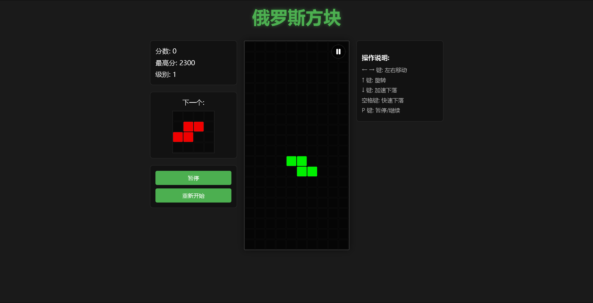

# Vue3 俄罗斯方块游戏

这是一个使用Vue3和TypeScript开发的现代化俄罗斯方块游戏。游戏保持了经典俄罗斯方块的核心玩法，同时采用了现代化的技术栈和优雅的界面设计。支持PC端和移动端，提供了良好的跨设备体验。



## 版本

当前版本：v1.0.2

### 更新日志

查看完整的[更新日志](./CHANGELOG.md)

## 功能特点

- 经典的俄罗斯方块游戏玩法
- 支持方块旋转和移动
- 实时分数统计和最高分记录
- 下一个方块预览功能
- 游戏级别系统，随分数提高自动加速
- 游戏暂停/继续功能
- 切换标签页或最小化窗口时自动暂停
- 行消除闪烁动画效果
- 游戏结束提示
- 响应式设计，同时支持PC端和移动端
- 移动端触摸控制支持
- 现代化UI界面
- 墙踢算法，使方块旋转更加智能

## 技术栈

- Vue3 - 渐进式JavaScript框架
- TypeScript - 添加静态类型的JavaScript超集
- Vite - 下一代前端构建工具
- Composition API - Vue3的组合式API
- LocalStorage - 本地存储最高分记录
- requestAnimationFrame - 高精度动画帧控制API

## 本地开发

确保你的开发环境中已安装Node.js (推荐v14.0.0或更高版本)

```bash
# 克隆项目
git clone https://github.com/yhj050124/Tetris.git

# 进入项目目录
cd Tetris

# 安装依赖
npm install

# 启动开发服务器
npm run dev

# 构建生产版本
npm run build
```

## 游戏控制

### PC端控制
- ⬅️ 方向键左：向左移动方块
- ➡️ 方向键右：向右移动方块
- ⬆️ 方向键上：旋转方块
- ⬇️ 方向键下：加速下落
- 空格键：快速下落（硬降）
- P键：暂停/继续游戏

### 移动端控制
- 左右滑动：左右移动方块
- 点击旋转按钮：旋转方块
- 向下滑动：加速下落
- 快速下滑：快速下落（硬降）
- 点击暂停按钮：暂停/继续游戏

## 游戏规则

1. 方块会从顶部随机出现并下落
2. 使用控制键移动和旋转方块，使其填满一行
3. 当一行被完全填满时，该行会被消除，并获得分数
4. 消除的行数越多，获得的分数越高：
   - 1行：100分
   - 2行：300分
   - 3行：500分
   - 4行：800分
5. 每获得500分，游戏速度会提升一级
6. 当方块堆叠到顶部无法再放置新方块时，游戏结束

## 项目结构

```
src/
  ├── components/     # 组件目录
  │   ├── TetrisBoard.vue     # 主游戏组件
  │   ├── GameBoard.vue       # 游戏板组件
  │   ├── NextPiecePreview.vue # 下一个方块预览组件
  │   ├── ScoreDisplay.vue    # 分数显示组件
  │   └── ControlButtons.vue  # 控制按钮组件
  ├── types/          # 类型定义
  │   └── tetris.ts   # 游戏类型定义
  ├── utils/          # 工具函数
  │   └── tetrisUtils.ts # 游戏工具函数
  ├── services/       # 服务层
  │   ├── tetrisGameService.ts # 游戏逻辑服务
  │   └── gameStateService.ts  # 游戏状态管理服务
  ├── constants/      # 常量定义
  │   └── gameConstants.ts # 游戏常量
  ├── assets/         # 静态资源
  ├── App.vue         # 根组件
  ├── main.ts         # 入口文件
  └── style.css       # 全局样式
```

## 特别功能

- **自适应布局**：根据屏幕尺寸自动调整游戏界面
- **双端设计**：PC端采用三栏布局，移动端采用垂直布局
- **墙踢算法**：当方块旋转时遇到墙壁，会尝试自动调整位置
- **本地存储**：使用localStorage保存最高分记录
- **游戏级别系统**：随着分数增加，游戏速度会自动提升
- **智能暂停**：当用户切换标签页或最小化窗口时，游戏会自动暂停，防止意外游戏结束
- **高精度动画**：使用requestAnimationFrame实现流畅的游戏动画和精确的时间控制
- **消除动画效果**：行消除时的闪烁动画，提升游戏视觉体验

## 未来计划

- 添加背景音乐和音效
- 实现多主题切换功能
- 添加排行榜系统
- 增加更多的方块形状和颜色
- 添加特殊方块和道具系统

## 贡献

欢迎提交问题和改进建议！如果你想为项目做出贡献，请遵循以下步骤：

1. Fork 项目
2. 创建你的特性分支 (`git checkout -b feature/amazing-feature`)
3. 提交你的更改 (`git commit -m 'Add some amazing feature'`)
4. 推送到分支 (`git push origin feature/amazing-feature`)
5. 打开一个 Pull Request

## 许可证

[MIT License](LICENSE)

## 致谢

- 感谢所有经典俄罗斯方块游戏的启发
- 感谢Vue.js团队提供的优秀框架
- 感谢所有为项目提供反馈和建议的用户 